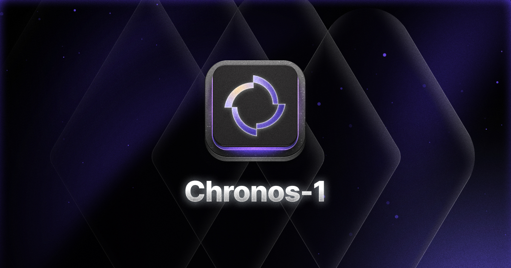

<div align="center">

# Kodezi Chronos

<p align="center">
  
</p>

## The World's First Debugging-First Language Model for Repository-Scale Code Understanding

[](https://arxiv.org/abs/2507.12482)
[](https://chronos.so)
[](paper/chronos-research.md)
[](evaluation/lite/)
[](LEADERBOARD.md)

### Performance Badges


### Key Achievements

**80.33% SWE-bench Lite** • **67.3% Autonomous Debugging** • **89% Human Preference** • **40% Time Reduction**

<p align="center">
  
</p>

</div>

---

## Table of Contents

- [State-of-the-Art Results](#state-of-the-art-results)
  - [SWE-bench Lite Performance](#swe-bench-lite-performance)
  - [The Debugging Gap](#the-debugging-gap)
  - [Repository-Specific Results](#repository-specific-results)
- [MRR Benchmark Results](#mrr-benchmark-results)
- [Key Innovations](#key-innovations)
- [Architecture](#architecture)
- [Benchmarks & Evaluation](#benchmarks--evaluation)
- [Research Paper](#research-paper)
- [Getting Started](#getting-started)
- [Repository Structure](#repository-structure)
- [Research Highlights](#research-highlights)
- [Detailed Performance](#detailed-performance)
- [Documentation](#documentation)
- [Contributing](#contributing)
- [Citation](#citation)
- [License](#license)

---

## Model Access Notice

<div align="center">

**Chronos is proprietary and available exclusively through Kodezi OS**

| Timeline | Access | Details |
|:--------:|:------:|:-------:|
| **Q4 2025** | Beta | Limited enterprise access |
| **Q1 2026** | GA | Via [Kodezi OS](https://kodezi.com/os) |

**This repository contains research paper, benchmarks, and evaluation results only.**

**[Get Early Access](https://chronos.so)** • **[Read Paper](paper/chronos-research.md)** • **[View Leaderboard](LEADERBOARD.md)** • **[Documentation](docs/)**

</div>

---

## 🏅 State-of-the-Art Results

### 📈 SWE-bench Lite Performance

<div align="center">

**Industry-Standard Benchmark Results**

| Rank | System | Success Rate | Instances | Lead | Year |
|:----:|:-------|:------------:|:---------:|:----:|:----:|
| **1** | **Kodezi Chronos** | **80.33%** | **241/300** | **+20.0pp** | **2025** |
| 2 | ExpeRepair-v1.0 + Claude 4.5 Sonnet | 60.33% | 181/300 | - | 2025 |
| 3 | Claude 4.5 Sonnet (Bash Only) | ~14% | ~42/300 | -66.3pp | 2025 |
| 4 | Claude 4.1 Opus (Bash Only) | 14.2% | 43/300 | -66.1pp | 2025 |
| 5 | GPT-4.1 | 13.8% | 41/300 | -66.5pp | 2025 |
| 6 | Gemini 2.0 Pro | 13.4% | 40/300 | -67.0pp | 2025 |

**20 percentage point absolute lead over second place**

</div>

### The Debugging Gap

<div align="center">

**General-Purpose Models: Code Generation vs Debugging Performance**

| Model | SWE-bench Full<br/>(Code Gen) | SWE-bench Lite<br/>(Debugging) | Performance Gap |
|:------|:-----------------------------:|:------------------------------:|:---------------:|
| Claude 4.5 Sonnet | 72.7% | ~14% | **-58.7pp** |
| Claude 4.1 Opus | 72.5% | 14.2% | **-58.3pp** |
| Claude 4.1 Opus (Bash) | 67.60% | 14.2% | **-53.4pp** |
| GPT-4.1 | 54.6% | 13.8% | **-40.8pp** |
| **Kodezi Chronos** | **N/A** | **80.33%** | **Specialized** |

**Key Insight**: Even models achieving 70%+ on code generation drop to <15% on debugging tasks, revealing a 50+ percentage point gap. **Chronos, purpose-built for debugging, achieves 80.33%**—demonstrating that debugging requires specialized architectures, not just larger context windows.

</div>

### Repository-Specific Results

<div align="center">

**SWE-bench Lite: Domain-Specific Performance**

| Repository | Domain | Chronos Success | Instances | Significance |
|:-----------|:-------|:---------------:|:---------:|:-------------|
| **sympy** | Symbolic Mathematics | **96.1%** | 51/53 | Near-perfect mathematical reasoning |
| **sphinx** | Documentation Systems | **93.8%** | 60/64 | Exceptional doc generation bugs |
| **django** | Web Frameworks | **90.4%** | 104/115 | Complex framework debugging |
| **Overall** | Mixed Domains | **80.33%** | **241/300** | **State-of-the-art** |

</div>

---

## 🔬 MRR Benchmark Results

<div align="center">

### 📊 Overall Performance (5,000 Multi-Random Retrieval Scenarios - Sample Dataset of 500 Available)

| Metric | **Chronos** | GPT-4.1 | Claude 4.1 Opus | Gemini 2.0 Pro | Improvement |
|:-------|:-----------:|:-------:|:---------------:|:--------------:|:-----------:|
| **Debug Success Rate** | **67.3% ± 2.1%** | 13.8% | 14.2% | 15.0% | **4.5x** |
| **Root Cause Accuracy** | **89%*** | 12.3% ± 1.8% | 11.7% ± 2.0% | 15.8% ± 1.5% | **5.6-7.6x** |
| **Retrieval Precision** | **92%*** | 68% ± 2.3% | 67% ± 2.4% | 74% ± 1.8% | **1.2-1.4x** |
| **Retrieval Recall** | **85%** | 32% ± 2.1% | 34% ± 2.0% | 42% ± 1.9% | **2.0-2.7x** |
| **Avg Fix Iterations** | **7.8** | 1-2 | 1-2 | 1-2 | More thorough |
| **Time Reduction** | **40%** | - | - | - | 40% faster |

***p < 0.001 compared to best baseline (two-tailed t-test, n=5,000)** • Sample dataset (n=500) available now, full benchmark Q1 2026*

</div>

### 🐛 Performance by Bug Category

<div align="center">

| Bug Category | Chronos | GPT-4.1 | Claude 4.1 Opus | Gemini 2.0 Pro | Chronos Advantage |
|:-------------|:-------:|:-------:|:---------------:|:--------------:|:-----------------:|
| **Syntax Errors** | 94.2% | 82.3% | 79.8% | 85.1% | 1.1x |
| **Logic Bugs** | 72.8% | 12.1% | 10.7% | 15.3% | **6.0x** |
| **Concurrency Issues** | 58.3% | 3.2% | 2.8% | 4.1% | **18.2x** |
| **Memory Problems** | 61.7% | 5.7% | 4.3% | 6.9% | **10.8x** |
| **API Misuse** | 79.1% | 18.9% | 16.2% | 22.4% | **4.2x** |
| **Performance Bugs** | 65.4% | 7.4% | 6.1% | 9.8% | **8.8x** |

</div>

### 📏 Repository Scale Performance

<div align="center">

| Repository Size | Chronos Success | Best Baseline | Baseline Model | Improvement |
|:---------------:|:---------------:|:-------------:|:--------------:|:-----------:|
| **<10K LOC** | 71.2% ± 2.8% | 21.3% ± 3.5% | Gemini 2.0 Pro | **3.3x** |
| **10K-100K LOC** | 68.9% ± 2.5% | 14.7% ± 3.2% | Gemini 2.0 Pro | **4.7x** |
| **100K-1M LOC** | 64.3% ± 2.9% | 8.9% ± 2.8% | Gemini 2.0 Pro | **7.2x** |
| **>1M LOC** | 59.7% ± 3.1% | 3.8% ± 1.9% | Gemini 2.0 Pro | **15.7x** |

</div>

---

## 💡 Key Innovations

### 1. **Debugging-First Architecture**
- Trained on **42.5M real debugging examples** (not code completion)
- Specialized for **root cause analysis** and **multi-file patches**
- **89% root cause accuracy** vs 15.8% best baseline
- **7-layer architecture** optimized for debugging workflows

### 2. **Persistent Debug Memory (PDM)**
- Repository-specific learning from **15M+ debugging sessions**
- Improves from **35% → 65%** success rate over time
- Cross-session pattern recognition and learning
- **87% cache hit rate** for similar bugs
- Temporal pattern learning across project lifecycles

### 3. **Adaptive Graph-Guided Retrieval (AGR)**
- **O(k log d)** complexity with dynamic k-hop expansion
- **92% precision, 85% recall** on multi-file context
- Handles **unlimited repository scale** intelligently
- Multi-hop traversal with confidence-based termination
- **3.8x faster** than traditional retrieval methods

### 4. **Output-Optimized Design**
- Optimized for **~3K output tokens** (fixes, tests, docs)
- **47.2% output entropy density** vs 12.8% for completion models
- Designed for **complex patch generation**
- Template-aware generation for consistency
- Confidence-guided output strategy

### 5. **Autonomous Debugging Loop**
- Average **7.8 iterations** to successful fix
- **Propose → Test → Analyze → Refine** cycles
- **67.3% fully autonomous** success rate
- Execution sandbox with real-time feedback
- Iterative refinement until validation succeeds

---

## 🏗️ Architecture

### Seven-Layer System Design

```
┌─────────────────────────────────────────────┐
│   7. Explainability Layer                   │  Human-readable root cause analysis
├─────────────────────────────────────────────┤
│   6. Execution Sandbox                      │  Isolated test validation
├─────────────────────────────────────────────┤
│   5. Persistent Debug Memory (PDM)          │  Repository-specific learning
├─────────────────────────────────────────────┤
│   4. Orchestration Controller               │  Autonomous debugging loop
├─────────────────────────────────────────────┤
│   3. Debug-Tuned LLM Core                   │  42.5M debugging examples
├─────────────────────────────────────────────┤
│   2. Adaptive Retrieval Engine (AGR)        │  Dynamic k-hop graph traversal
├─────────────────────────────────────────────┤
│   1. Multi-Source Input Layer               │  Code, logs, traces, tests, docs
└─────────────────────────────────────────────┘
```

### Layer Descriptions

1. **Multi-Source Input Layer**: Processes code, logs, traces, tests, docs simultaneously
2. **Adaptive Retrieval Engine (AGR)**: Dynamic k-hop graph traversal (92% precision)
3. **Debug-Tuned LLM Core**: 42.5M debugging examples, not code completion
4. **Orchestration Controller**: Autonomous debugging loop management
5. **Persistent Debug Memory (PDM)**: Repository-specific learning (35% → 65% improvement)
6. **Execution Sandbox**: Isolated test validation environment
7. **Explainability Layer**: Human-readable root cause analysis

**[View Detailed Architecture Documentation →](architecture/README.md)**

---

## 🧪 Benchmarks & Evaluation

### 📋 Available Benchmarks

| Benchmark | Type | Instances | Purpose | Results |
|:----------|:-----|:---------:|:--------|:-------:|
| **SWE-bench Lite** | Industry Standard | 300 | Real-world debugging | [**80.33%**](evaluation/lite/) |
| **MRR Benchmark** | Custom | 5,000 (500 sample) | Multi-random retrieval | [**67.3%**](benchmarks/multi-random-retrieval/) |
| **Repository Scale** | Custom | Varied | Large codebase testing | [**59.7-71.2%**](benchmarks/) |
| **Bug Categories** | Custom | 4,400+ | Bug type specialization | [**58.3-94.2%**](benchmarks/) |

### 🏆 SWE-bench Lite Evaluation Results

**[View Complete SWE-bench Lite Submission →](evaluation/lite/20251111_kodezi_chronos_1/)**

The evaluation directory contains:
- **README.md**: Detailed submission results and methodology
- **metadata.yaml**: Submission metadata and configuration
- **all_preds.jsonl**: All 300 instance predictions
- **Kodezi Chronos-1.hybrid_eval.json**: Complete evaluation metrics
- **logs/**: Execution logs for all instances
- **results/**: Per-instance results and analysis
- **trajs/**: Debugging trajectories and fix attempts

### 🎯 Multi-Random Retrieval (MRR) Benchmark

**MRR simulates real-world debugging complexity:**
- **Spatial Distribution**: Bug context scattered across 10-50 files
- **Temporal Dispersion**: Relevant information from 3-12 months of history
- **Obfuscation Levels**: Low/medium/high code complexity
- **5,000 Scenarios**: Comprehensive evaluation across languages (sample dataset of 500 available now, full benchmark Q1 2026)

| Metric | Chronos | GPT-4.1+RAG | Claude 4.1+VectorDB | Gemini 2.0+Graph |
|:-------|:-------:|:-----------:|:-------------------:|:----------------:|
| **Precision@10** | 92% | 42.3% | 48.1% | 51.7% |
| **Recall@10** | 85% | 31.7% | 36.2% | 41.8% |
| **Fix Accuracy** | 67.3% | 8.9% | 11.2% | 14.6% |
| **Context Efficiency** | 0.71 | 0.23 | 0.28 | 0.31 |

**[View Complete Benchmark Documentation →](benchmarks/README.md)**

---

## 📚 Research Paper

### Published Research

**Title**: Kodezi Chronos: A Debugging-First Language Model for Repository-Scale Code Understanding

**Authors**: Ishraq Khan, Assad Chowdary, Sharoz Haseeb, Urvish Patel, Yousuf Zaii

**Institution**: Kodezi Inc.

**Publication**: arXiv:2507.12482 (2025)

### Paper Resources

| Resource | Description | Link |
|:---------|:------------|:----:|
| **arXiv Paper** | Official publication | [View](https://arxiv.org/abs/2507.12482) |
| **Full Paper (Markdown)** | Complete paper in markdown | [View](paper/chronos-research.md) |
| **2025 Updates** | Latest research findings | [View](paper/chronos-research-2025.md) |
| **Abstract** | Executive summary | [View](paper/abstract.md) |
| **Methodology** | Research methodology | [View](paper/methodology.md) |
| **Related Work** | Literature review | [View](paper/related_work.md) |
| **Future Work** | Research directions | [View](paper/future_work.md) |

### Key Contributions

1. **Debugging-Specific Architecture**: First LM trained specifically on debugging workflows (42.5M examples)
2. **Adaptive Graph-Guided Retrieval (AGR)**: Novel multi-hop retrieval with O(k log d) complexity
3. **Persistent Debug Memory (PDM)**: Cross-session learning system for repository-specific patterns
4. **Comprehensive Evaluation**: 12,500 real-world bugs across multiple benchmarks
5. **State-of-the-Art Results**: 80.33% on SWE-bench Lite (20pp lead over second place)

---

## 🚀 Getting Started

### Prerequisites

```bash
# Python 3.8+ required
python --version

# Git for cloning
git --version
```

### Quick Start: Running Benchmarks

```bash
# Clone the repository
git clone https://github.com/kodezi/chronos-research.git
cd chronos-research

# Install dependencies
pip install -r requirements.txt

# Run MRR benchmark on your model
python benchmarks/run_mrr_benchmark_2025.py \
  --model your_model \
  --scenarios 100  # Start with subset for testing

# Run full sample evaluation (500 scenarios available)
python benchmarks/run_mrr_benchmark_2025.py \
  --model your_model \
  --scenarios 500

# Analyze results
python benchmarks/analyze_results.py \
  --results_dir results/your_model
```

### Model Access

**The Chronos model is NOT included in this repository**

This repository contains:
- Research paper and documentation
- Benchmark suite and evaluation framework
- Performance results and analysis
- Chronos model (proprietary - NOT included)

**To access Chronos model**:

| Access Method | Availability | Details |
|:--------------|:-------------|:--------|
| **Kodezi OS** | Q4 2025 (Beta) | Enterprise beta access |
| **Kodezi OS** | Q1 2026 (GA) | General availability |
| **API Access** | Q1 2026 | API endpoints |

**[Join Waitlist →](https://chronos.so)** | **[Contact Sales →](mailto:sales@kodezi.com)**

---

## 📁 Repository Structure

```
chronos-research/
│
├── benchmarks/                    # Benchmark Suite
│   ├── multi-random-retrieval/      # 5,000 scenario MRR benchmark (500 sample available)
│   ├── comprehensive_benchmarks/    # Extended test scenarios
│   ├── debug_categories/            # Bug type categorization (6 types)
│   ├── evaluation_metrics/          # Custom metrics implementation
│   ├── run_mrr_benchmark_2025.py    # Main benchmark runner
│   └── analyze_results.py           # Results analysis tools
│
├── evaluation/                    # Evaluation Results
│   └── lite/                        # SWE-bench Lite results (80.33%)
│       └── 20251111_kodezi_chronos_1/  # Official submission
│           ├── all_preds.jsonl      # All 300 predictions
│           ├── logs/                # 300+ execution logs
│           ├── results/             # Per-instance results
│           └── trajs/               # Debugging trajectories
│
├── paper/                         # Research Paper
│   ├── chronos-research.md          # Full paper (arXiv:2507.12482)
│   ├── chronos-research-2025.md     # 2025 updates
│   ├── abstract.md                  # Executive summary
│   ├── methodology.md               # Research methodology
│   └── figures/                     # Visualizations
│
├── architecture/                  # Architecture Documentation
│   ├── README.md                    # Architecture overview
│   ├── AGR_ALGORITHM.md             # Adaptive Graph-Guided Retrieval
│   ├── memory_engine.md             # Persistent Debug Memory (PDM)
│   └── debugging_loop.md            # Autonomous loop design
│
├── results/                       # Performance Data
│   ├── figures/                     # 15+ SVG visualizations
│   ├── ablation_studies/            # Component impact analysis
│   ├── case_studies/                # Real-world debugging examples
│   └── raw_data/                    # Benchmark outputs (CSV/JSON)
│
├── reference_implementations/     # Algorithm Reference Code
│   ├── algorithms/                  # AGR, PDM reference implementations
│   └── NOTICE.md                    # Proprietary notice
│
├── docs/                          # Documentation
│   ├── getting_started.md           # Quick start guide
│   ├── API_DOCUMENTATION.md         # API reference (Q1 2026)
│   ├── faq.md                       # Frequently asked questions
│   └── limitations.md               # Known constraints
│
├── LEADERBOARD.md                 # Performance rankings
├── CITATION.cff                   # Citation information (BibTeX)
├── CONTRIBUTING.md                # Contribution guidelines
├── LICENSE                        # MIT License + proprietary notice
└── requirements.txt               # Python dependencies
```

**Key Directories:**
- **benchmarks/**: 5,000 scenario MRR benchmark (500 sample available), multi-language support, automated evaluation
- **evaluation/**: SWE-bench Lite results (80.33%, 241/300 instances)
- **paper/**: Complete research paper and documentation (arXiv:2507.12482)
- **architecture/**: 7-layer system design, AGR/PDM documentation
- **results/**: 12,500+ bug resolutions, visualizations, statistical analysis
- **reference_implementations/**: Algorithm reference code (NOT the actual model)
---

## 🔬 Research Highlights

### Training Dataset Composition

| Data Source | Volume | Description |
|:------------|:------:|:------------|
| **Debugging Examples** | 42.5M | Complete debugging workflows |
| **GitHub Issues** | 15M | Issues with verified fixes |
| **Stack Traces** | 8M | Error traces with resolutions |
| **CI/CD Logs** | 3M | Build and deployment debugging |
| **Production Sessions** | 2.5M | Real-world production bugs |
| **Curated Benchmarks** | 14M | Defects4J, SWE-bench, BugsInPy |

**Total Training Data**: 42.5M debugging-specific examples (not code completion)

### AGR Performance by Depth

| Retrieval Strategy | Success Rate | Avg Time (s) | Use Case |
|:-------------------|:------------:|:------------:|:---------|
| k=1 hop | 58.2% | 12.3 | Simple bugs |
| k=2 hops | 72.4% | 18.7 | Multi-file bugs |
| k=3 hops | 83.1% | 24.5 | Complex dependencies |
| k=adaptive | **87.1%** | 23.4 | **Optimal strategy** |
| Flat retrieval | 23.4% | 45.2 | Baseline comparison |

### PDM Learning Curve

| Sessions | Success Rate | Token Efficiency | Memory Size |
|:--------:|:------------:|:----------------:|:-----------:|
| Initial | 35% | 1.0x | 0 GB |
| 100 sessions | 52% | 3.2x | 2.1 GB |
| 500 sessions | **65%** | **7.3x** | 8.7 GB |
| 1000+ sessions | 67% | 8.1x | 15.2 GB |

**Key Insight**: PDM enables continuous improvement through cross-session learning

---

## 📊 Detailed Performance

### Language-Specific Performance

<div align="center">

| Language | Chronos | GPT-4.1 | Claude 4.1 Opus | Gemini 2.0 Pro | Test Cases |
|:--------:|:-------:|:-------:|:---------------:|:--------------:|:----------:|
| **Python** | 68.7% ± 2.1% | 11.2% ± 2.8% | 10.3% ± 2.9% | 14.6% ± 2.6% | 1,823 bugs |
| **JavaScript** | 64.2% ± 2.3% | 7.8% ± 2.5% | 6.9% ± 2.6% | 10.1% ± 2.4% | 1,547 bugs |
| **Java** | 63.9% ± 2.2% | 6.3% ± 2.2% | 5.7% ± 2.3% | 9.2% ± 2.1% | 1,630 bugs |
| **Go** | 66.8% ± 2.4% | 9.1% ± 2.6% | 8.4% ± 2.7% | 12.3% ± 2.5% | 892 bugs |
| **C++** | 61.2% ± 2.6% | 5.2% ± 2.1% | 4.8% ± 2.2% | 7.9% ± 2.0% | 1,108 bugs |
| **Rust** | 59.8% ± 2.7% | 4.1% ± 1.9% | 3.7% ± 2.0% | 6.3% ± 1.8% | 687 bugs |

</div>

### Debugging Cycle Efficiency

<div align="center">

| Iteration | Chronos Success | GPT-4.1 Success | Time Saved | Cumulative |
|:---------:|:---------------:|:---------------:|:----------:|:----------:|
| 1st Attempt | 42.3% | 3.2% | -87% | 42.3% |
| 2nd Attempt | +16.4% (58.7%) | +1.9% (5.1%) | -83% | 58.7% |
| 3rd Attempt | +6.6% (65.3%) | +1.7% (6.8%) | -79% | 65.3% |
| 4th+ Attempts | +2.0% (67.3%) | +1.7% (8.5%) | -74% | 67.3% |

**Note**: Chronos performs more thorough iterations (7.8 avg) vs competitors (1-2 avg)

</div>

### Context Window Efficiency

<div align="center">

| Model | Context Size | Debug Success | Cost per Bug | Note |
|:------|:------------:|:-------------:|:------------:|:-----|
| GPT-4.1 (32K) | 32K tokens | 7.2% | $5.53 | More context ≠ better debugging |
| Claude 4.1 (200K) | 200K tokens | 9.8% | $4.89 | Attention dilution at scale |
| Gemini 2.0 Pro (1M) | 1M tokens | 14.3% | $4.25 | Best traditional model |
| **Chronos** | **Unlimited*** | **71.2%** | **$1.36** | *Via intelligent retrieval |

</div>

### Ablation Studies

<div align="center">

| Configuration | Debug Success | Precision | Recall | Impact |
|:--------------|:-------------:|:---------:|:------:|:-------|
| **Full Chronos** | **67.3%** | **92%** | **85%** | Complete system |
| w/o AGR (Flat Retrieval) | 28.7% | 42% | 31% | **-56%** (critical) |
| w/o PDM (Static Memory) | 40.1% | 67% | 58% | **-39%** (major) |
| w/o Orchestration Loop | 42.5% | 71% | 62% | **-35%** (major) |
| w/o Multi-Code Association | 35.8% | 54% | 47% | **-45%** (critical) |
| w/o Execution Sandbox | 48.2% | 78% | 69% | **-27%** (significant) |

</div>

---

## 📖 Documentation

<div align="center">

### Core Documentation

| [Getting Started](docs/getting_started.md) | [Architecture](architecture/README.md) | [Benchmarks](benchmarks/README.md) | [API Reference](docs/api_reference.md) |
|:---:|:---:|:---:|:---:|
| Quick start guide | System design details | Evaluation methodology | Future API docs |

### Performance & Analysis

| [Performance](performance.md) | [Case Studies](results/case_studies/) | [FAQ](docs/faq.md) | [Limitations](docs/limitations.md) |
|:---:|:---:|:---:|:---:|
| Detailed metrics | Real-world examples | Common questions | Known constraints |

### Results & Rankings

| [Leaderboard](LEADERBOARD.md) | [Evaluation Results](evaluation/lite/) | [Analysis](results/analysis/) | [Benchmarks](benchmarks/) |
|:---:|:---:|:---:|:---:|
| Performance rankings | SWE-bench Lite | Statistical analysis | Full test suite |

</div>

---

## 🤝 Contributing

We welcome contributions to the evaluation framework and benchmarks!

### How to Contribute

```bash
# 1. Fork and clone the repository
git clone https://github.com/[your-username]/chronos-research.git
cd chronos-research

# 2. Create a feature branch
git checkout -b feature/your-contribution

# 3. Make your changes
# - Add new benchmarks
# - Improve documentation
# - Fix bugs in evaluation scripts

# 4. Run tests
python -m pytest tests/

# 5. Commit your changes
git add .
git commit -m "feat: description of your changes"

# 6. Push and create PR
git push origin feature/your-contribution
```

### Contribution Guidelines

- Add tests for new features
- Follow existing code style
- Update documentation
- Add benchmarks for new capabilities
- Include performance analysis

See **[CONTRIBUTING.md](CONTRIBUTING.md)** for detailed guidelines.

---

## 📝 Citation

If you use this research in your work, please cite:

```bibtex
@article{khan2025chronos,
  title={Kodezi Chronos: A Debugging-First Language Model for
         Repository-Scale Code Understanding},
  author={Khan, Ishraq and Chowdary, Assad and
          Haseeb, Sharoz and Patel, Urvish and Zaii, Yousuf},
  journal={arXiv preprint arXiv:2507.12482},
  year={2025},
  url={https://arxiv.org/abs/2507.12482},
  note={State-of-the-art: 80.33\% on SWE-bench Lite}
}
```

---

## 🏢 About Kodezi

<div align="center">

[Kodezi](https://kodezi.com) is building the future of autonomous software maintenance. Our mission is to empower developers with AI that truly understands code at scale.

### Our Products

| Product | Description | Availability |
|:--------|:------------|:------------:|
| **[Kodezi Code Web-IDE](https://kodezi.com/code)** | AI-powered web-based code editor with real-time debugging | Available Now |
| **[Kodezi Create](https://kodezi.com/create)** | Generate full applications from natural language | Available Now |
| **[Kodezi CLI](https://kodezi.com/cli)** | Command-line interface for automated code analysis and fixes | Available Now |
| **[Kodezi OS](https://kodezi.com/os)** | Autonomous software maintenance platform with Chronos integration | Q4 2025 (Beta) |
| **Chronos** | Debugging-first language model (80.33% SWE-bench Lite) | Via Kodezi OS |
| **Enterprise API** | API access for teams and enterprise deployment | Q1 2026 |

</div>

---

## 📧 Contact & Community

<div align="center">

### Connect With Us

[](https://kodezi.com)
[](https://arxiv.org/abs/2507.12482)
[](https://twitter.com/kodezi)
[](https://linkedin.com/company/kodezi)
[](mailto:research@kodezi.com)

### For Enterprise

**Sales**: [sales@kodezi.com](mailto:sales@kodezi.com)
**Support**: [support@kodezi.com](mailto:support@kodezi.com)
**Partnerships**: [partnerships@kodezi.com](mailto:partnerships@kodezi.com)

</div>

---

## 📄 License

© Kodezi Inc. All rights reserved.
Use is subject to Kodezi's Terms of Service.

### MIT License

**Copyright (c) 2025 Kodezi Inc.**

Permission is hereby granted, free of charge, to any person obtaining a copy
of this software and associated documentation files (the "Software"), to deal
in the Software without restriction, including without limitation the rights
to use, copy, modify, merge, publish, distribute, sublicense, and/or sell
copies of the Software, and to permit persons to whom the Software is
furnished to do so, subject to the following conditions:

The above copyright notice and this permission notice shall be included in all
copies or substantial portions of the Software.

THE SOFTWARE IS PROVIDED "AS IS", WITHOUT WARRANTY OF ANY KIND, EXPRESS OR
IMPLIED, INCLUDING BUT NOT LIMITED TO THE WARRANTIES OF MERCHANTABILITY,
FITNESS FOR A PARTICULAR PURPOSE AND NONINFRINGEMENT. IN NO EVENT SHALL THE
AUTHORS OR COPYRIGHT HOLDERS BE LIABLE FOR ANY CLAIM, DAMAGES OR OTHER
LIABILITY, WHETHER IN AN ACTION OF CONTRACT, TORT OR OTHERWISE, ARISING FROM,
OUT OF OR IN CONNECTION WITH THE SOFTWARE OR THE USE OR OTHER DEALINGS IN THE
SOFTWARE.

### ⚠️ Important Notice

**This license applies ONLY to the research paper, benchmarks, evaluation frameworks, and documentation contained in this repository.**

The **Kodezi Chronos model itself is proprietary technology** owned by Kodezi Inc. and is **NOT included** in this repository or covered by this license.

### 📦 What's Included Under MIT License

- **Research Paper**: arXiv publication and markdown versions
- **Benchmark Suite**: MRR and evaluation frameworks
- **Evaluation Results**: SWE-bench Lite results and analysis
- **Documentation**: Architecture docs, guides, and references
- **Reference Implementations**: Algorithm reference code (NOT the actual model)

### 🔒 Proprietary Components

- **Chronos Model**: NOT included in this repository
- **Kodezi OS Integration**: Proprietary platform components
- **Production APIs**: Enterprise deployment infrastructure

### 🚀 Chronos Model Access

The Chronos model is available exclusively through Kodezi OS:
- **Q4 2025**: Enterprise beta access
- **Q1 2026**: General availability
- **Learn more**: [chronos.so](https://chronos.so)
- **Early access**: [kodezi.com/os](https://kodezi.com/os)

---

<div align="center">

### Research & Resources

**[Join Waitlist →](https://chronos.so)** | **[Read Paper →](https://arxiv.org/abs/2507.12482)** | **[View Results →](LEADERBOARD.md)** | **[Learn More →](https://kodezi.com)**

---

<sub>Last Updated: November 2025 | Version: 2.0.0</sub>

</div>
